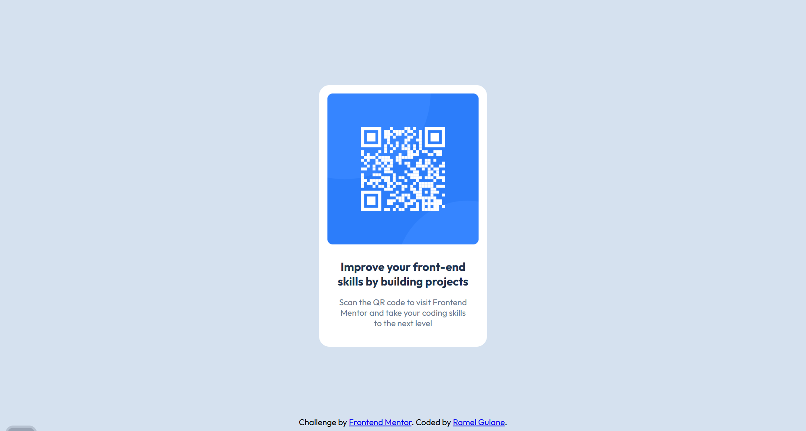

# Frontend Mentor - QR code component solution

This is a solution to the [QR code component challenge on Frontend Mentor](https://www.frontendmentor.io/challenges/qr-code-component-iux_sIO_H). Frontend Mentor challenges help you improve your coding skills by building realistic projects. 

## Table of contents

- [Overview](#overview)
  - [Screenshot](#screenshot)
  - [Links](#links)
- [My process](#my-process)
  - [Built with](#built-with)
  - [What I learned](#what-i-learned)


## Overview
This is a simple and clean QR Code Component challenge solution inspired by Frontend Mentor. The goal was to replicate a given design and improve front-end skills by implementing a responsive layout with HTML and CSS.

### Screenshot



### Links

- Solution URL: [View Code](https://github.com/Ramelzkie96/QR-Code-Component.git)
- Live Site URL: [Live Site](https://qr-components-code.netlify.app/)

## My process

### Built with

- Semantic HTML5 markup
- CSS3 (custom properties, Flexbox, and Grid)
- Google Fonts (Outfit)


### What I learned

1. Centering with Flexbox
I used Flexbox to center the container both vertically and horizontally within the viewport:
```css
body {
  display: flex;
  justify-content: center;
  align-items: center;
  min-height: 100vh;
  background: var(--slate-300);
}

```
2. Responsive Layout with CSS Grid
Inside the card, I used CSS Grid to stack and space out content, making it easy to maintain layout flow:
```css
.container {
  display: grid;
  padding: 16px;
  text-align: center;
  background: var(--white);
  border-radius: 20px;
}
 ```
 3. Styling with CSS Variables
To make the design consistent and easy to manage, I used custom CSS variables for colors:
```css
:root {
  --slate-900: #1F314F;
  --slate-500: #68778D;
  --slate-300: #d5e1ef;
  --white: #ffffff;
}
 ```
4. Image Responsiveness and Styling
I ensured the QR code image stayed within its bounds, scaled properly, and had rounded corners:
```css
.image-container img {
  width: 100%;
  height: auto;
  object-fit: contain;
  border-radius: 10px;
}

 ```


